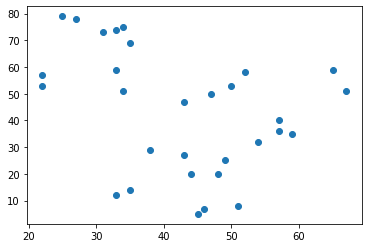
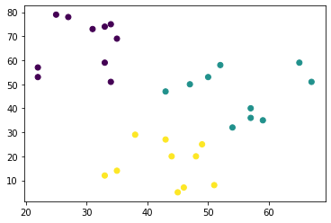
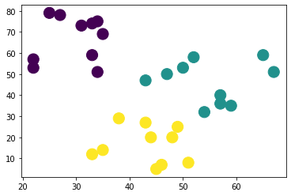
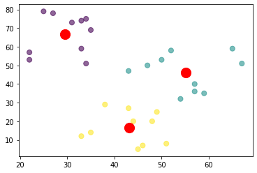
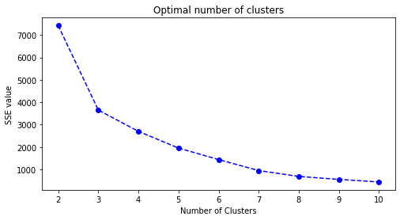

```python
import numpy as np

x = np.random.random(2) # 產生2筆隨機數值
y = np.random.random(2) # 產生2筆隨機數值

print(x)
print(y)
```

    [0.45836265 0.2280715 ]
    [0.08365091 0.32002199]
    


```python
distance = np.sqrt(np.sum(np.square(x-y))) # 土法煉鋼設計公式

print(distance)
```

    0.38582869456934793
    


```python
distance2 = np.linalg.norm(x-y) # 使用線性代數下的範數求算向量距離

print(distance2)
```

    0.38582869456934793
    


```python
from scipy.spatial.distance import pdist

array = np.vstack([x, y]) # 透過vstack()將原始資料合併成陣列

distance3 = pdist(array, 'euclidean')

# 使用pdist()求算距離，第一參數為資料來源，第二參數為計算距離

print(distance3)
```

    [0.38582869]
    


```python
import pandas as pd

data = {
    'x': [25,34,22,27,33,33,31,22,35,34,67,54,57,43,50,57,59,52,65,47,49,48,35,33,44,45,38,43,51,46],
    'y': [79,51,53,78,59,74,73,57,69,75,51,32,40,47,53,36,35,58,59,50,25,20,14,12,20,5,29,27,8,7]
}

df = pd.DataFrame(data, columns=['x','y'])

df
```


<div>

<table border="1" class="dataframe">
  <thead>
    <tr style="text-align: right;">
      <th></th>
      <th>x</th>
      <th>y</th>
    </tr>
  </thead>
  <tbody>
    <tr>
      <td>0</td>
      <td>25</td>
      <td>79</td>
    </tr>
    <tr>
      <td>1</td>
      <td>34</td>
      <td>51</td>
    </tr>
    <tr>
      <td>2</td>
      <td>22</td>
      <td>53</td>
    </tr>
    <tr>
      <td>3</td>
      <td>27</td>
      <td>78</td>
    </tr>
    <tr>
      <td>4</td>
      <td>33</td>
      <td>59</td>
    </tr>
    <tr>
      <td>5</td>
      <td>33</td>
      <td>74</td>
    </tr>
    <tr>
      <td>6</td>
      <td>31</td>
      <td>73</td>
    </tr>
    <tr>
      <td>7</td>
      <td>22</td>
      <td>57</td>
    </tr>
    <tr>
      <td>8</td>
      <td>35</td>
      <td>69</td>
    </tr>
    <tr>
      <td>9</td>
      <td>34</td>
      <td>75</td>
    </tr>
    <tr>
      <td>10</td>
      <td>67</td>
      <td>51</td>
    </tr>
    <tr>
      <td>11</td>
      <td>54</td>
      <td>32</td>
    </tr>
    <tr>
      <td>12</td>
      <td>57</td>
      <td>40</td>
    </tr>
    <tr>
      <td>13</td>
      <td>43</td>
      <td>47</td>
    </tr>
    <tr>
      <td>14</td>
      <td>50</td>
      <td>53</td>
    </tr>
    <tr>
      <td>15</td>
      <td>57</td>
      <td>36</td>
    </tr>
    <tr>
      <td>16</td>
      <td>59</td>
      <td>35</td>
    </tr>
    <tr>
      <td>17</td>
      <td>52</td>
      <td>58</td>
    </tr>
    <tr>
      <td>18</td>
      <td>65</td>
      <td>59</td>
    </tr>
    <tr>
      <td>19</td>
      <td>47</td>
      <td>50</td>
    </tr>
    <tr>
      <td>20</td>
      <td>49</td>
      <td>25</td>
    </tr>
    <tr>
      <td>21</td>
      <td>48</td>
      <td>20</td>
    </tr>
    <tr>
      <td>22</td>
      <td>35</td>
      <td>14</td>
    </tr>
    <tr>
      <td>23</td>
      <td>33</td>
      <td>12</td>
    </tr>
    <tr>
      <td>24</td>
      <td>44</td>
      <td>20</td>
    </tr>
    <tr>
      <td>25</td>
      <td>45</td>
      <td>5</td>
    </tr>
    <tr>
      <td>26</td>
      <td>38</td>
      <td>29</td>
    </tr>
    <tr>
      <td>27</td>
      <td>43</td>
      <td>27</td>
    </tr>
    <tr>
      <td>28</td>
      <td>51</td>
      <td>8</td>
    </tr>
    <tr>
      <td>29</td>
      <td>46</td>
      <td>7</td>
    </tr>
  </tbody>
</table>
</div>


```python
import matplotlib.pyplot as plt
from sklearn import cluster, datasets, metrics
from sklearn.cluster import KMeans

n_clusters = 3

kmeans = cluster.KMeans(n_clusters).fit(df) # 將df資料配適到KMeans()

kmeans
```


    KMeans(algorithm='auto', copy_x=True, init='k-means++', max_iter=300,
           n_clusters=3, n_init=10, n_jobs=None, precompute_distances='auto',
           random_state=None, tol=0.0001, verbose=0)


```python
centroids = kmeans.cluster_centers_ # 取出各群中心點
print(centroids)
```

    [[29.6 66.8]
     [55.1 46.1]
     [43.2 16.7]]
    


```python
cluster_labels = kmeans.labels_ # 顯示樣本資料隸屬集群
print(cluster_labels)
```

    [0 0 0 0 0 0 0 0 0 0 1 1 1 1 1 1 1 1 1 1 2 2 2 2 2 2 2 2 2 2]
    


```python
plt.scatter(df['x'], df['y'])
```


    <matplotlib.collections.PathCollection at 0x246fc369848>





```python
plt.scatter(df['x'], df['y'], c=kmeans.labels_)
```


    <matplotlib.collections.PathCollection at 0x21f7ef60e48>





```python
plt.scatter(df['x'], df['y'], c=kmeans.labels_, s=200)
```


    <matplotlib.collections.PathCollection at 0x21f7f01f188>





```python
# scatter()內接收第四個參數為資料點漸層係數，數值很小越透明

plt.scatter(df['x'],df['y'], c=kmeans.labels_, s=50, alpha=0.6)

# 接續執行第二次scatter()，第一個接受參數為。

plt.scatter(centroids[:,0], centroids[:,1], c='red', s=200)
```


    <matplotlib.collections.PathCollection at 0x21f7f0879c8>





```python
centroids
```


    array([[29.6, 66.8],
           [55.1, 46.1],
           [43.2, 16.7]])


```python
centroids[:,0]
```


    array([29.6, 55.1, 43.2])


```python
centroids[:,1]
```


    array([66.8, 46.1, 16.7])


```python
SSE = []

k = range(2,11)

for x in k:
    kmean_optimized = KMeans(n_clusters=x)
    kmean_optimized.fit(df)
    SSE.append(kmean_optimized.inertia_) # 計算inertia_，即SSE
    
plt.figure(figsize=(8,4))
plt.plot(k,SSE,'bo--')
plt.title("Optimal number of clusters")
plt.xlabel('Number of Clusters')
plt.ylabel("SSE value")
```


    Text(0, 0.5, 'SSE value')




